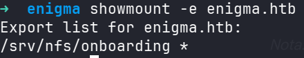
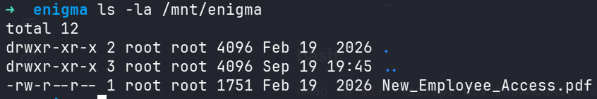
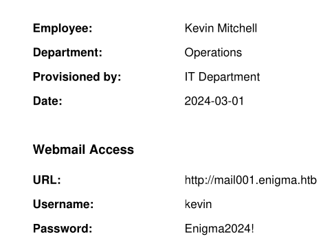
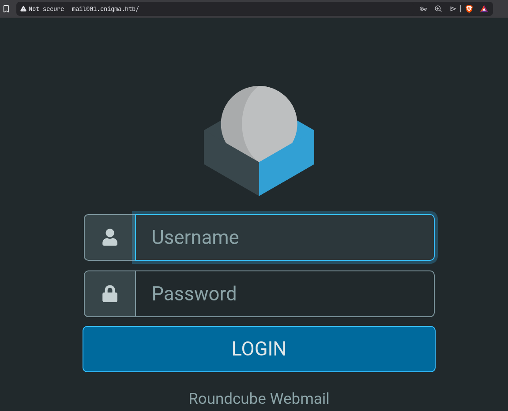
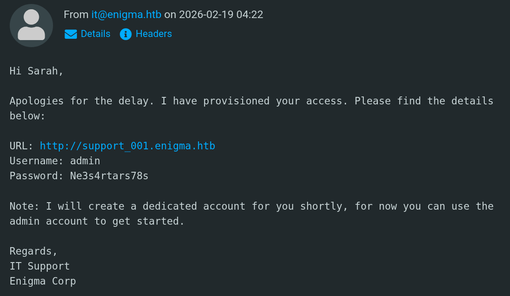
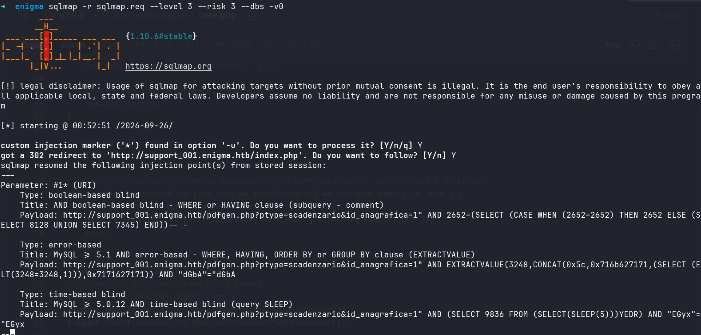
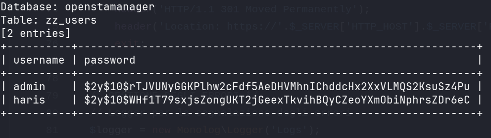
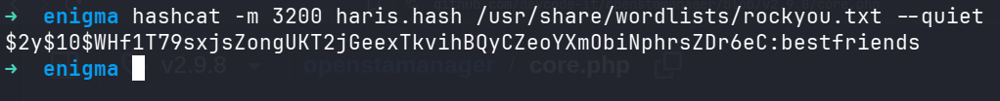

# Enigma 
---

# Recon

Nmap dircovered the ports 22,80,110,111,143,993,995,2049, the most interesting ports are 111 and 2048 related to nfs (Network File System).



NFS exposes the directory `/srv/nfs/onboarding` to any client, so it is possible to mount it and inspect its contents.

```bash
sudo mkdir /mnt/enigma
sudo mount -t nfs enigma.htb:/srv/nfs/onboarding /mnt/enigma
```


The share contains interesting information about an employee.



The address http://mail001.enigma.htb hosts a login for the roundcube mail server version 1.6.16.



The credentials kevin:Enigma2024! works in roundcube, there is an email from sarah@enigma.htb and the relevant part of the email states "You should be receiving your access credentials shortly via the company shared drive" maybe alluding to the credentials in nfs, there isn't further useful information, but using the credentials sarah:Enigma2024!, in Sarah's mail box there is a message from it@enigma.htb, this message discloses the credentials admin:Ne3s4rtars78s and the domain support_001.enigma.htb.



The domain support_001.enigma.htb hosts an OpenSTAManager version 2.9.8, this is vulnerable to [CVE-2025-69216](https://github.com/devcode-it/openstamanager/security/advisories/GHSA-q6g3-fv43-m2w6).

## Understanding the vulnerability

OpenSTAManager has a SQLi vulnerability in the id_anagrafica parameter; the vulnerability enables complete database read access through error-based SQL injection techniques.

```php
//openstamanager/templates/scadenzario/init.php
if (get('id_anagrafica') && get('id_anagrafica') != 'null') {
    $module_query = str_replace('1=1', '1=1 AND `co_scadenziario`.`idanagrafica`="'.get('id_anagrafica').'"', $module_query);
    $id_anagrafica = get('id_anagrafica');
}
...
$records = $dbo->fetchArray($module_query);

//openstamanager/src/Database.php
public function fetchArray($query, $parameters = [], $numeric = false){
    $mode = empty($numeric) ? PDO::FETCH_ASSOC : PDO::FETCH_NUM;
    $statement = $this->getPDO()->prepare($query);
    $statement->execute($parameters);
    $result = $statement->fetchAll($mode);
    return $result;
}
```
The `id_anagrafica` parameter is concatenated with the SQL query; to prevent this vulnerability, a parameterized query must be used.

## Exploitation 



Openstamanager stores users hashed credentials in the table zz_users.



The hash algorithm is Blowfish(OpenBSD), using hashcat module 3200 it's possible to recover the credentials.



--- 
# Resources 

https://hackviser-com.translate.goog/tactics/pentesting/services/nfs
