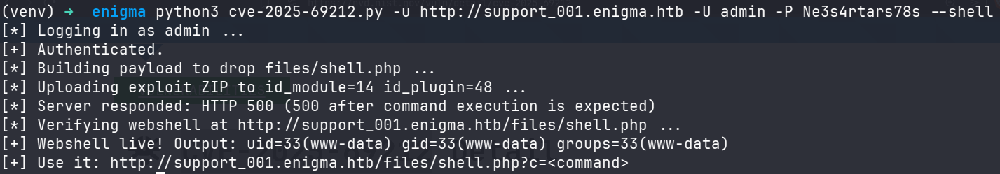
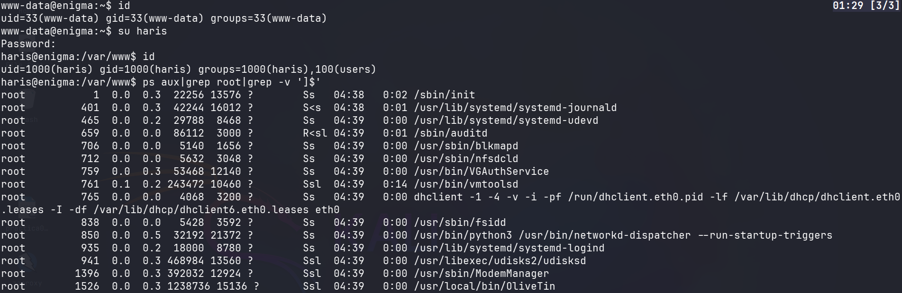
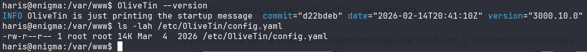
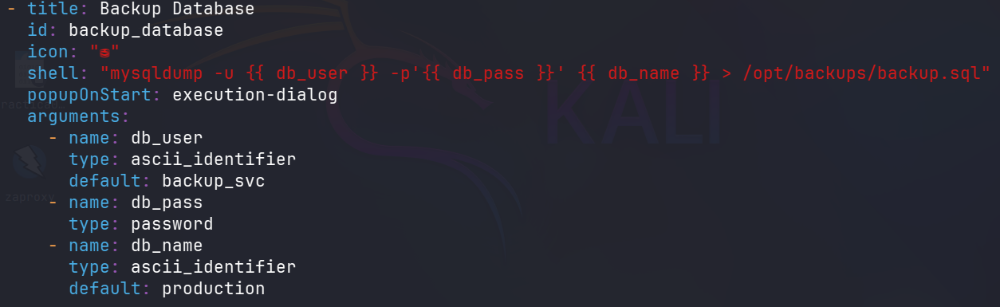
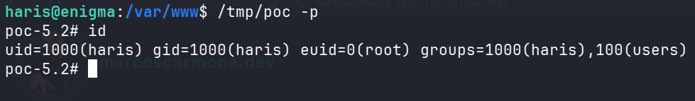

# Enigma 
---

# Recon

Nmap dircovered the ports 22,80,110,111,143,993,995,2049, the most interesting ports are 111 and 2048 related to nfs (Network File System).


NFS exposes the directory `/srv/nfs/onboarding` to any client, so it is possible to mount it and inspect its contents.

```bash
sudo mkdir /mnt/enigma
sudo mount -t nfs enigma.htb:/srv/nfs/onboarding /mnt/enigma
```


The share contains interesting information about an employee.


The address http://mail001.enigma.htb hosts a login for the roundcube mail server version 1.6.16.


The credentials kevin:Enigma2024! works in roundcube, there is an email from sarah@enigma.htb and the relevant part of the email states "You should be receiving your access credentials shortly via the company shared drive" maybe alluding to the credentials in nfs, there isn't further useful information, but using the credentials sarah:Enigma2024!, in Sarah's mail box there is a message from it@enigma.htb, this message discloses the credentials admin:Ne3s4rtars78s and the domain support_001.enigma.htb.


The domain support_001.enigma.htb hosts an OpenSTAManager version 2.9.8.

## SQLi vulnerability

This OpenSTAManager version has a SQLi vulnerability in the id_anagrafica parameter; the vulnerability enables complete database read access through error-based SQL injection techniques [CVE-2025-69216](https://nvd.nist.gov/vuln/detail/cve-2025-69216).

```php
//openstamanager/templates/scadenzario/init.php
if (get('id_anagrafica') && get('id_anagrafica') != 'null') {
    $module_query = str_replace('1=1', '1=1 AND `co_scadenziario`.`idanagrafica`="'.get('id_anagrafica').'"', $module_query);
    $id_anagrafica = get('id_anagrafica');
}
...
$records = $dbo->fetchArray($module_query);

//openstamanager/src/Database.php
public function fetchArray($query, $parameters = [], $numeric = false){
    $mode = empty($numeric) ? PDO::FETCH_ASSOC : PDO::FETCH_NUM;
    $statement = $this->getPDO()->prepare($query);
    $statement->execute($parameters);
    $result = $statement->fetchAll($mode);
    return $result;
}
```
The `id_anagrafica` parameter is concatenated with the SQL query; to prevent this vulnerability, a parameterized query must be used.

### Exploitation 


Openstamanager stores users hashed credentials in the table zz_users.


The hash algorithm is Blowfish(OpenBSD), using hashcat module 3200 it's possible to recover the credentials.


## RCE vulnerability

Another vulnerability in this openstamanager version is [CVE-2025-69212](https://nvd.nist.gov/vuln/detail/cve-2025-69212). The decodeP7M() function in src/Util/XML.php invokes exec() with user-controlled data incorporated directly into an OpenSSL command.

```php
//openstamanager/src/Util/XML.php
public static function decodeP7M($file){
    exec('openssl smime -verify -noverify -in "'.$file.'" -inform DER -out "'.$output_file.'"', $output, $cmd);
```
The `$file` argument is concatenated directly into a shell command without appropriate shell argument escaping. Consequently, shell metacharacters may be interpreted by the command shell, resulting in OS command injection.

### Exploitation

Using the [PoC](https://github.com/BridgerAlderson/CVE-2025-69212-PoC) is possible to obtain a webshell.



# Privilege Escalation

To identify privilege-escalation paths, an entry point may be the root's running processes, we can list it using the `ps` command.



## OS Command Injection 

Olivetin is a root's running process, the version is 3000.10.0 which is vulnerable to [cve-2026-27626](https://nvd.nist.gov/vuln/detail/cve-2026-27626). 



The password typed parameters are vulnerable to OS command injection via the Olivetin api startaction endpoint.



In `/etc/OliveTin/config.yaml` there is an action named `backup_database` with the parameter `db_pass` which is of type password, so acording with the CVE we can inject this parameter.


Then we have command injection as root.



--- 
# Resources 
Configuration. (s. f.-b). https://docs.olivetin.app/config.html

NFS (Network File System) Pentesting | Hackviser. (s. f.). https://hackviser.com/tactics/pentesting/services/nfs

Devcode-It. (s. f.). OS Command Injection in P7M File Processing. GitHub. https://github.com/devcode-it/openstamanager/security/advisories/GHSA-25fp-8w8p-mx36

Devcode-It. (s. f.-b). SQL Injection in Scadenzario Print Template. GitHub. https://github.com/devcode-it/openstamanager/security/advisories/GHSA-q6g3-fv43-m2w6

CVE-2026-27626 - GitHub Advisory Database. (s. f.). GitHub. https://github.com/advisories/GHSA-49gm-hh7w-wfvf
