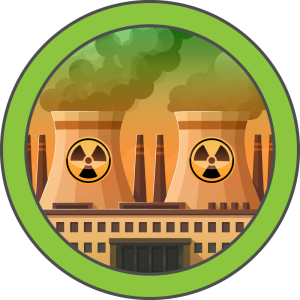

Difficulty: Easy
OS: Linux

---
# Tools
- nmap
- wappalyzer

---
# Attack Path
1. Recon
2. Exploitation
3. Lateral Movement
4. Privilege Escalation
---
## Recon
Running a full-port `nmap` scan reveals port 3000 hosting an HTTP server and port 22 running SSH. Wappalyzer indicates the web application uses:

- React
- Next.js v15.0.3
- Priority Hints
    

Next.js v15.0.3 is potentially vulnerable to CVE-2025-29927 and CVE-2025-55182.

---
## Exploitation
Using the `react2shell` exploit, I obtained a reverse shell as the `node` user. 
![[HTB/Labs/reactor/screenshots/revshell.png]]

---
## Lateral Movement

- **System users:** 
![[system_users.png]]

- **Current directory files:**
![[files_curr.png]]

Checking the `.env` file reveals that the database management system (DBMS) is SQLite and points to the database file `reactor.db`.
![[env_file.png]]

Inspecting the database reveals a `users` table containing a hashed password for `engineer`, who is also a valid system user.

![[users_table.png]]

Using `hashid` to identify the hash algorithm, I cracked the hash using `hashcat` to retrieve the plain-text password for `engineer`.
![[hashid.png]]
